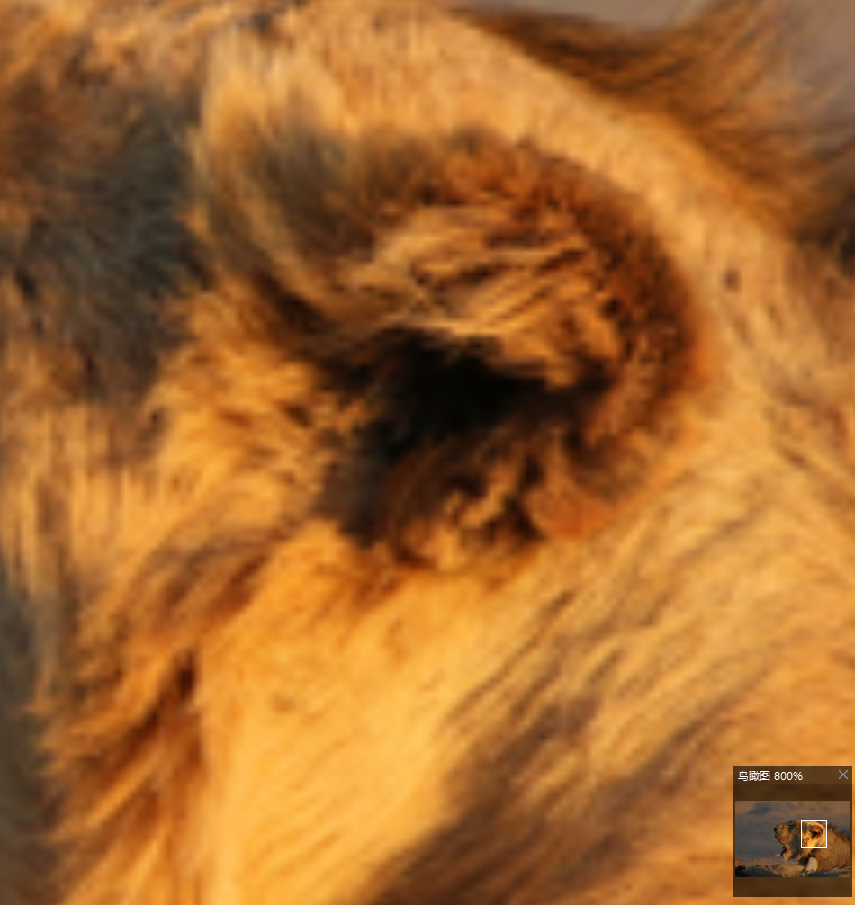

# 超分算法

> 计算机视觉第七次作业  |  2101212840   游盈萱

[TOC]

## 任务描述

Github或者主页下载运行一个超分算法，获得结果试着训练一两个Epoch，给出超分结果

## 超分算法 EDSR 学习

**Enhanced Deep Residual Networks for Single Image Super-Resolution** from CVPRW 2017

EDSR是NTIRE2017超分辨率挑战赛上获得冠军的方案。EDSR的网络结构如下：

EDSR借鉴了ResNet网络基于残差的学习机制，输入经过一层卷积后兵分两路，一条经过n层的ResBlock再卷积一次，另一条直接通到交汇处，进行加权求和，再进行上采样和卷积输出结果。

## 实验

### 训练1个epoch

**训练过程**：

**测试过程**：

**超分结果**：

左 - 原图，右 - 超分结果

 
 

放大2倍之后可以看到超分结果中耳鬓的毛发稍微清晰一些。

### 训练300个epochs

**训练过程**：

**测试过程**：

**超分结果**：

左 - 原图，右 - 超分结果

 
 

放大2倍之后可以看到超分结果中耳鬓的毛发比1个epoch的更清晰。

### 官方模型

**测试过程**：

**超分结果**：

左 - 原图，右 - 超分结果

 
 

放大4倍之后可以看到超分结果中耳鬓的毛发也很清晰。

